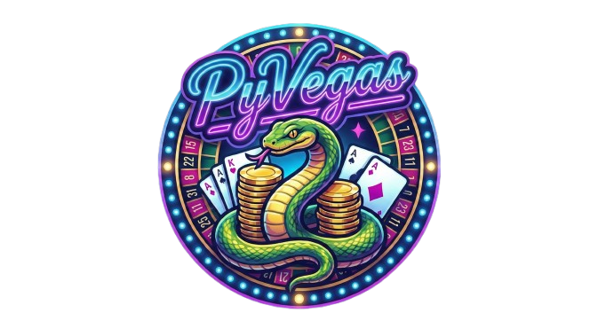

[](README.pl.md)

<div align="center">




</div>

## 📋 Table of Contents
- [Introduction](#-introduction)
- [Game Modules](#-game-modules)
  - [Blackjack](#-blackjack)
  - [Crash](#-crash)
- [Setup Instructions](#-setup-instructions)
- [Project Structure](#-project-structure)
- [Authors](#-authors)
- [Credits & License](#-credits--license)

## 💡 Introduction

**PyVegas** is a project created as part of computer science studies using Python. The goal was to create a single, simple application collecting several mini-games in one place. The program features a unified **main menu**, allowing users to launch a selected game, track gameplay progress, and return to choose another title at any time.

The project is designed with a **modular** architecture: each game has its own logic located in the `games/` directory, while shared elements (e.g., navigation, input handling, common components) are separated into `core/`. Additionally, the repository includes an `assets/` directory dedicated to resources used in the games (graphics, sounds, fonts). This structure facilitates development and the addition of new games without the need to refactor the entire application.

Currently, the collection includes:
- **Blackjack** - a classic card game played against the dealer.
- **Crash** - a chance game based on increasing multipliers and the decision to cash out at the right moment.
## 🖥️ Main Menu

The central hub of the application (`core/`) that unites all mini-games into a single ecosystem.

**Key Features:**
* **Seamless Navigation:** An optimized state management system allows for instant transitions between Blackjack, Crash, and the menu without restarting the application.
* **Interactive Buttons:** The user interface responds dynamically to player actions – buttons feature hover states (highlighting) and click animations.
* **Sound Manager:** A global audio module initialized at startup. It handles background music mixing, sound effects (SFX) playback, and centralized volume management.
* **Settings & Guide:** A dedicated settings panel where players can adjust game parameters and access the **built-in manual** (game rules and controls) without exiting the application.

## 🎮 Game Modules

### ♠️ Blackjack

An advanced Blackjack simulation focusing on smooth gameplay, procedural animations, and **player-favorable casino rules**.

**Key Features:**
* **Multiple Decks:** Simulates a "shoe" consisting of **6 decks**, automatically reshuffled when 75% of cards are used.
* **Dealer Logic (Soft 17):** Implements the rule where the dealer hits on a Soft 17.
* **Full Action Set:** Hit, Stand, Double Down, Split, and Surrender.
* **Advanced Rendering:** Cards are not static images—they are **procedurally drawn** in real-time (shapes, pips, shadows), allowing for perfect scaling.
* **Animations:** Smooth interpolation of card movement during dealing.

**House Rules:**
* ✅ **No hit restrictions after Splitting Aces:** Players can hit after splitting Aces.
* ✅ **Blackjack after Split (3:2):** A 21 value from two cards after a split is treated as a Blackjack.
* ✅ **No "Dealer Peek":** The dealer checks for Blackjack only if the face-up card is an Ace.

### 🚀 Crash

A dynamic "Crypto/Stock" style game that tests greed and reflexes. Inspired by the *Bustabit* mechanic.

**Key Features:**
* **Bustabit-like Algorithm:** The crash point is generated using a proven algorithm based on *Inverse Probability Distribution*.
* **Auto Cashout:** A system allowing players to set an automatic cashout at a specific multiplier.
* **Multiplier System:** Exponential growth of the chart value (`growth_speed`) simulating a market "pump".
* **Visualization:** Dynamic chart rendering using polygons with gradient filling.
* **History:** A "History Pills" bar tracking recent results to spot trends.
* **Audio Feedback:** A "riser" sound effect that builds tension as the multiplier increases.

## ⚙️ Setup Instructions

To run the project on your machine, follow these steps in your terminal:

1.  **Clone the repository:**
    ```bash
    git clone [https://github.com/apaternoga/pygames.git](https://github.com/apaternoga/pygames.git)
    cd pygames
    ```

2.  **Install dependencies:**
    The project requires the `pygame` library. To install it, run:
    ```bash
    pip install -r requirements.txt
    ```

3.  **Run the game:**
    To launch the main menu and start playing, run:
    ```bash
    python main.py
    ```

## 📂 Project Structure

The project maintains a clean file structure by separating logic from assets:

* `main.py` – Application entry point (engine initialization, main loop).
* `core/` – System core (menu, settings, sound manager, input handling).
* `games/` – Logic for specific games (Blackjack, Crash).
* `assets/` – Multimedia resources (sounds, graphics, fonts).
* `requirements.txt` – List of required Python libraries.
* `CREDITS.txt` – Detailed information about asset sources.

## 👥 Authors

* **Adrian Paternoga** - **Team Leader**, Blackjack Logic, Animation & Rendering, Project Managment
* **Adam Zalewski** - Crash Logic, Animations & UI, Project Coordination, Blackjack Tester
* **Filip Liskowski** - README, Blackjack Tester
* **Miłosz Kiedrzyński** - 
* **Patryk Iżbicki** - 
* **Borys Kaczka** - 

## 📚 Credits & License

### License
This project is available under the **AGPL-3.0** license.

Copyright © 2025 **Adrian Paternoga**, **Adam Zalewski**.

The software is provided "as is", without warranty of any kind. You are free to use, modify, merge, publish, and distribute the code, provided the above copyright notice is included. See the `LICENSE` file for details.

### Resources & Tools

**1. Crash Game:**
* **Algorithm:** The `_generate_crash_point` function is implemented based on the open-source code of **Bustabit** (Inverse Probability Distribution).
    * **License:** Bustabit v1-webserver is licensed under **AGPL-3.0**.
    * [Bustabit Repository Link](https://github.com/bustabit/v1-webserver)

**2. Audio:**
* **Background Music:** Tracks released under **Public Domain (CC0)** license – no attribution required.
* **Music (Crash Riser):** Track *"Crash Climb Riser"* generated using **Suno AI**.
* **Sound Effects (SFX):** Sourced from **Kenney** and **Pixabay** libraries.
* **UI Sounds:** Hover and click sounds sourced from **Freesound** (CC0 license).

**3. Graphics:**
* **Menu Background:** Sourced from **Pexels.com**.
* **Logos:** Generated using the **Gemini** model (Google).

**4. AI Usage Disclosure:**
Artificial Intelligence tools were used as a development assistant in this project:
* **Code:** LLM models (Gemini/ChatGPT) were used for code refactoring, algorithm optimization, and documentation generation.
* **Assets:** Selected visual and audio resources were created using generative AI tools (Suno AI, Gemini).
