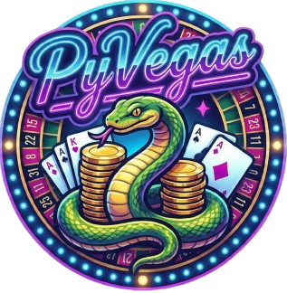

[](README.md)
<div align="center">




</div>

## 📋 Spis treści
- [Wprowadzenie](#-wprowadzenie)
- [Moduły Gier](#-moduły-gier)
  - [Blackjack](#-blackjack)
  - [Crash](#-crash)
- [Instrukcja uruchomienia](#-instrukcja-uruchomienia)
- [Struktura projektu](#-struktura-projektu)
- [Autorzy](#-autorzy)
- [Źródła i Licencja](#-źródła-i-licencja)

## 💡 Wprowadzenie

**PyVegas** to projekt powstały w ramach studiów informatycznych realizowany w Pythonie, którego celem jest stworzenie jednej, prostej aplikacji zbierającej kilka mini-gier w jednym miejscu. Program udostępnia wspólne **menu główne**, z którego można uruchomić wybraną grę, śledzić przebieg rozgrywki i w każdej chwili wrócić do wyboru kolejnej pozycji.

Projekt został zaprojektowany w sposób **modułowy**: każda gra posiada własną logikę w katalogu `games/`, natomiast elementy współdzielone (np. nawigacja, obsługa wejścia, wspólne komponenty) są wydzielone do `core/`. Dodatkowo repozytorium zawiera katalog `assets/` przeznaczony na zasoby wykorzystywane w grach (np. grafiki, dźwięki, czcionki). Taka struktura ułatwia rozwój projektu oraz dodawanie kolejnych gier bez przebudowy całej aplikacji.

Aktualnie w zestawie znajdują się m.in.:
- **Blackjack** - klasyczna gra karciana przeciwko krupierowi,
- **Crash** - gra losowa oparta o rosnący mnożniki i decyzję o wypłacie w odpowiednim momencie..

## 🖥️ Menu Główne

Centralny hub aplikacji (`core/`), który spaja wszystkie mini-gry w jeden ekosystem.

**Główne funkcjonalności:**
* **Płynna nawigacja:** Zoptymalizowany system zarządzania stanem gry pozwala na błyskawiczne przełączanie się między Blackjackiem, Crashem a menu bez konieczności restartowania aplikacji.
* **Interaktywne przyciski:** Interfejs użytkownika reaguje dynamicznie na akcje gracza – przyciski posiadają stany "hover" (podświetlenie po najechaniu) oraz animacje kliknięcia.
* **Sound Manager:** Globalny moduł audio inicjowany przy starcie. Odpowiada za miksowanie muzyki w tle, odtwarzanie efektów dźwiękowych (SFX) oraz centralne zarządzanie głośnością.
* **Ustawienia i Instrukcja:** Dedykowany panel ustawień, w którym gracz może nie tylko dostosować parametry gry, ale również zapoznać się z **wbudowaną instrukcją** (zasady gier i sterowanie) bez wychodzenia z aplikacji.

## 🎮 Moduły Gier

### ♠️ Blackjack

Zaawansowana symulacja Blackjacka kładąca nacisk na płynność rozgrywki, proceduralne animacje i **korzystne dla gracza zasady kasynowe**.

***Główne funkcjonalności:**
* **Wielokrotne talie:** Gra symuluje „but” (shoe) składający się z **6 talii**, tasowany automatycznie przy zużyciu 75% kart.
* **Logika Krupiera (Soft 17):** Zaimplementowano zasadę, w której krupier dobiera karty przy miękkim 17.
* **Pełen wachlarz akcji:** Hit, Stand, Double Down, Split oraz Surrender.
* **Zaawansowany rendering:** Karty nie są statycznymi obrazkami – są **rysowane kodem** w czasie rzeczywistym (kształty, symbole, cienie), co pozwala na idealne skalowanie.
* **Animacje:** Płynna interpolacja ruchu kart przy rozdawaniu.
**Unikalne zasady (House Rules):**
* ✅ **Brak ograniczeń po Splicie Asów:** Możliwość dobierania kart po rozdzieleniu asów.
* ✅ **Blackjack po Splicie (3:2):** 21 punktów z dwóch kart po rozdzieleniu jest traktowane jako Blackjack.
* ✅ **Brak "Dealer Peek":** Krupier sprawdza Blackjacka tylko przy odsłoniętym Asie.

### 🚀 Crash

Dynamiczna gra typu "Crypto/Stock", testująca chciwość i refleks gracza. Inspirowana mechaniką *Bustabit*.

**Główne funkcjonalności:**
* **Bustabit-like Algorithm:** Punkt "wybuchu" (crash point) generowany jest na podstawie sprawdzonego algorytmu opartego na *Inverse Probability Distribution*.
* **Auto Cashout:** System pozwalający na ustawienie automatycznej wypłaty przy określonym mnożniku.
* **System Mnożnika:** Wykładniczy wzrost wartości wykresu (`growth_speed`) symulujący giełdową "pompę".
* **Wizualizacja:** Wykres rysowany dynamicznie za pomocą wielokątów z gradientowym wypełnieniem.
* **Historia:** Pasek ostatnich wyników (History Pills) pozwalający śledzić trendy.
* **Audio Feedback:** Dźwięk typu "riser", którego napięcie rośnie wraz z mnożnikiem.

## ⚙️ Instrukcja uruchomienia

Aby uruchomić projekt na swoim komputerze, wykonaj poniższe kroki w terminalu:

1. **Sklonuj repozytorium:**
   ```bash
   git clone [https://github.com/apaternoga/PyVegas.git](https://github.com/apaternoga/PyVegas.git)
   cd PyVegas
2. **Zainstaluj zależności:**
   Projekt wymaga biblioteki `pygame`. Aby ją zainstalować, wpisz w terminalu:
   ```bash
   pip install -r requirements.txt
3. **Uruchom grę:**
   Aby włączyć menu główne i rozpocząć grę, wpisz:
   ```bash
   python main.py
## 📂 Struktura projektu

Projekt zachowuje czystą strukturę plików, oddzielając logikę od zasobów:

* `main.py` – Punkt startowy aplikacji (inicjalizacja silnika, pętla główna).
* `core/` – Rdzeń systemu (menu, settings, sound manager, obsługa wejścia, UI helpers).
* `games/` – Logika poszczególnych gier (Blackjack, Crash).
* `assets/` – Zasoby multimedialne:
  * `images/` – Grafiki i logotypy UI.
  * `fonts/` – Pliki czcionek.
  * `music/` – Muzyka w tle.
  * `sfx/` – Wspólne efekty dźwiękowe.
  * `crash/` – Dźwięki specyficzne dla Crasha.
* `data/` – Dane zapisu (portfel).
* `requirements.txt` – Lista wymaganych bibliotek Python.
* `CREDITS.txt` – Szczegółowe informacje o źródłach assetów.


## 👥 Autorzy

* **Adrian Paternoga** - **lider zespołu**, logika, animacje i GUI Blackjacka, zarządzanie całością projektu.
* **Adam Zalewski** - Logika, animacje i GUI Crasha, koordynacja projektu, tester Blackjacka
* **Filip Liskowski** - README, Blackjack tester
* **Miłosz Kiedrzyński** - Implementacja globalnych systemów (Wallet, Sound Manager), logiki wyglądu kart oraz interaktywnego menu z animacjami i obsługą assetów
* **Patryk Iżbicki** - 
* **Borys Kaczka** - Logika, animacje, GUI i wykres Crasha

## 📚 Źródła i Licencja

### Licencja
Projekt udostępniany jest na licencji **AGPL-3.0**.

Copyright © 2025 **Adrian Paternoga**, **Adam Zalewski**.

Oprogramowanie jest dostarczane w stanie „takim, jakie jest”, bez udzielania jakichkolwiek gwarancji. Masz prawo do swobodnego używania, modyfikacji, łączenia, publikowania i dystrybucji kodu, pod warunkiem dołączenia powyższej noty o prawach autorskich. Szczegóły znajdują się w pliku `LICENSE`.

### Wykorzystane zasoby i Narzędzia (Credits)

**1. Gra Crash:**
* **Algorytm:** Funkcja `_generate_crash_point` zaimplementowana na podstawie otwartego kodu źródłowego **Bustabit** (Inverse Probability Distribution).
    * **Licencja:** Bustabit v1-webserver jest na licencji **AGPL-3.0**.
    * [Link do repozytorium Bustabit](https://github.com/bustabit/v1-webserver)

**2. Oprawa Audio:**
* **Muzyka w tle (Menu/Rozgrywka):** Utwory na licencji **Public Domain (CC0)** – brak wymogu atrybucji autora.
* **Muzyka (Crash Riser):** Utwór *"Crash Climb Riser"* wygenerowany przy użyciu narzędzia **Suno AI**.
* **Efekty dźwiękowe (SFX):** Biblioteki **Kenney** oraz **Pixabay**.
* **Dźwięki interfejsu (UI):** Dźwięki kliknięcia i najechania pobrane z serwisu **Freesound** (licencja CC0).

**3. Grafika:**
* **Tło Menu:** Pobrane z serwisu **Pexels.com**.
* **Logotypy:** Wygenerowane przy pomocy modelu **Gemini** (Google).

**4. Wykorzystanie Sztucznej Inteligencji (AI Disclosure):**
W projekcie wykorzystano narzędzia AI w charakterze asystenta deweloperskiego:
* **Kod:** Modele LLM (Gemini/ChatGPT) były wykorzystywane do refaktoryzacji kodu, optymalizacji algorytmów oraz generowania dokumentacji.
* **Assets:** Część zasobów wizualnych i dźwiękowych została wygenerowana przy użyciu generatywnej sztucznej inteligencji (Suno AI, Gemini).
